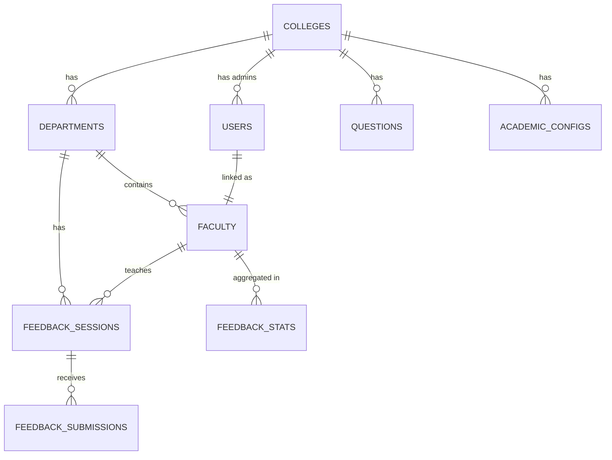

# Faculty Insights Hub

## Overview

**Faculty Insights Hub** is a **multi-college, role-based Faculty Feedback System** built as a **React application** using **Firebase Firestore** as its data store.

The system is designed for **academic institutions** to collect **anonymous and authenticated student feedback**, analyze faculty performance, and generate rich analytics.

This updated architecture replaces the concept of rigid **Feedback Cycles** with a more **open, flexible, and academic-friendly concept called `Feedback Sessions`**.

A **Feedback Session** represents a real classroom context:

> **One Faculty + One Subject + One Batch + One Academic Context**

Each session generates a **unique feedback link**, allowing students to submit feedback seamlessly.

---

## Key Architectural Shift (IMPORTANT)

### ❌ Old Concept

* Feedback Cycles (Semester-based, rigid)

### ✅ New Concept (Final)

* **Feedback Sessions** (Open, simple, real-world aligned)

### Academic Structure Configuration

The academic structure (courses, academic years, departments, subjects, batches) is configured per college in the **Academic Config**. This ensures consistency and prevents data entry errors.

### A Feedback Session is created by selecting from the configured academic structure:

* **Course / Program** (from configured courses)
* **Academic Year** (from configured years for the selected course)
* **Department** (from configured departments for the selected course/year)
* **Subject** (from configured subjects for the selected course/year/department)
* **Batch** (from configured batches)
* **Faculty** (from faculty list)

Once created:

* A **unique anonymous feedback URL** is generated
* Session can be **activated / deactivated** anytime
* Submissions are tied **only to that session**

This makes the system:

* More intuitive for colleges
* Easier to scale
* Easier to analyze at micro & macro levels

---

## Tech Stack

| Layer           | Technology                            |
| --------------- | ------------------------------------- |
| UI              | React (Functional Components + Hooks) |
| Styling         | Tailwind CSS                          |
| Routing         | React Router DOM                      |
| State & Caching | React Query                           |
| Charts          | Recharts                              |
| Icons           | lucide-react                          |
| Dates           | date-fns                              |
| Notifications   | sonner                                |
| Database        | Firebase Firestore                    |
| Authentication  | Firebase Auth                         |

---

## Production Setup

### Prerequisites

- Node.js 18+
- Firebase Project
- Environment variables configured

### Firebase Configuration

1. Create a Firebase project at https://console.firebase.google.com/
2. Enable Authentication with Email/Password provider
3. Enable Firestore Database
4. Copy your Firebase config values

### Environment Variables

Create a `.env` file in the root directory:

```env
VITE_FIREBASE_API_KEY=your_api_key_here
VITE_FIREBASE_AUTH_DOMAIN=your_project.firebaseapp.com
VITE_FIREBASE_PROJECT_ID=your_project_id
VITE_FIREBASE_STORAGE_BUCKET=your_project.appspot.com
VITE_FIREBASE_MESSAGING_SENDER_ID=your_sender_id
VITE_FIREBASE_APP_ID=your_app_id
VITE_FIREBASE_MEASUREMENT_ID=your_measurement_id
```

### Initial Setup

1. **Install dependencies:**
   ```bash
   npm install
   ```

2. **Configure Firebase:**
   - Update `.env` with your Firebase project credentials
   - Ensure Firebase Security Rules are properly configured

3. **Create Super Admin:**
   - Run the application
   - Use "Create Super Admin Account" on the login page
   - This creates the first administrator account

4. **Setup Colleges & Users:**
   - Super admin creates college administrators
   - College admins add departments and faculty
   - Faculty accounts are created automatically with secure passwords

### Security Features

- **No hardcoded credentials** - All user accounts created through admin interface
- **Firebase Authentication** - Secure user management
- **Password reset** - Built-in forgot password functionality
- **Role-based access** - Granular permissions system
- **Environment variables** - Sensitive config not in code

---

## Color Palette

* **Primary:** `#01224E` (Deep Navy Blue)
* **Secondary:** `#f5f5f5 / #f8f9fa`
* **Success:** `#10b981`
* **Warning:** `#f59e0b`
* **Error:** `#ef4444`
* **White:** `#ffffff`

---

## Application Routes

### Public

* `/` – Landing Page
* `/feedback/anonymous/:sessionId` – Anonymous Feedback Form

### Authenticated

* `/login` – Admin / Staff Login

### Role-Based Dashboards

* `/super-admin` – System Owner
* `/admin/dashboard` – College Admin
* `/admin/sessions` – Feedback Session Management
* `/admin/faculty` – Faculty Management
* `/admin/departments` – Department Management
* `/admin/questions` – Question Bank
* `/admin/reports` – Reports & Analytics
* `/admin/settings` – College Settings
* `/hod/dashboard` – Department-Level View
* `/faculty/dashboard` – Faculty Personal Dashboard

---

## Feedback Session Lifecycle

1. **College Admin creates a Session**
2. Selects academic context:

   * Course / Program
   * Academic Year
   * Department
   * Subject
   * Batch
   * Faculty
3. System generates:

   * `uniqueSessionId`
   * `anonymousFeedbackURL`
4. Session is activated
5. Students submit feedback anonymously
6. Faculty & Admin view analytics

---

## Roles & Permissions

### Super Admin

* Manage colleges
* Create college admins
* Reset demo data
* View system-wide analytics

### College Admin

* Manage departments & faculty
* Create feedback sessions
* Manage question bank
* View full college reports
* **Bulk import faculty allocations** from JSON data

#### Bulk Import Faculty Allocations

College administrators can bulk import faculty subject allocations using JSON data. This is useful for initial setup or large-scale updates.

**JSON Format:**
```json
[
  {
    "Full Name *": "Dr. Priyanka Pawar",
    "Program *": "MBA",
    "Year *": "1",
    "Department *": "Marketing Management",
    "Subjects *": "Marketing Management",
    "Subject Code*": "GC–09",
    "Subject Type*": "Theory",
    "Specialization": "Marketing Management"
  }
]
```

**Features:**
- Validates faculty names against existing faculty records
- Checks for subject conflicts before allocation
- Groups multiple subjects per faculty/course/department/year
- Updates existing allocations or creates new ones
- Provides detailed success/error reporting

**Access:** Available in the Faculty Allocation page via the "Bulk Import" button.

### HOD

* Department-only access
* View faculty performance
* Department analytics

### Faculty

* View own feedback only
* Trend analysis
* Anonymous comments
* Download reports

---

## Feedback Form Structure

### Question Categories

* Teaching Effectiveness
* Communication Skills
* Subject Knowledge
* Course Materials
* Overall Feedback

### Response Types

* Rating (1–5)
* Text
* Rating + Comment
* Select Dropdown
* Boolean (Yes/No)

### Features

* Multi-step form
* Auto-save every 30 seconds
* Progress indicator
* Accessibility compliant

---

## Firestore Database Schema

### Architecture Overview



### Collections Overview

| Collection | Purpose | Document Count (Est.) |
|------------|---------|----------------------|
| `colleges` | Multi-tenant college data | 2-10 |
| `users` | Authentication & roles | 50-500 |
| `departments` | Academic departments | 10-50 |
| `faculty` | Faculty member profiles | 50-200 |
| `feedbackSessions` | Active feedback links | 100-1,000 |
| `questions` | Question bank per college | 20-100 |
| `feedbackSubmissions` | Student responses | 1,000-100,000+ |
| `feedbackStats` | Pre-computed analytics | 100-500 |
| `academicConfigs` | Course/subject structure | 2-10 |
| `accessCodes` | One-time access codes | 100-1,000 |

### Key Collections

#### Feedback Sessions

```typescript
{
  id: string;
  collegeId: string;
  departmentId: string;
  facultyId: string;
  questionGroupId: string;
  
  // Academic context (selected from academicConfigs)
  course: string;
  academicYear: string;
  subject: string;
  batch: string;
  semester?: string;
  
  accessMode: 'anonymous' | 'authenticated' | 'mixed';
  uniqueUrl: string;
  qrCodeUrl?: string;
  isActive: boolean;
  status: 'draft' | 'active' | 'paused' | 'completed' | 'expired';
  
  stats: {
    submissionCount: number;
    averageRating: number;
    lastSubmissionAt?: Timestamp;
  };
  
  startDate: Timestamp;
  expiresAt: Timestamp;
  createdAt: Timestamp;
  createdBy: string;
  updatedAt: Timestamp;
}
```

#### Academic Configs

```typescript
{
  id: string; // collegeId
  collegeId: string;
  
  courseData: {
    [courseName: string]: {
      years: string[];
      yearDepartments: {
        [year: string]: string[]; // departments for this year
      };
      semesters?: string[];
    };
  };
  
  subjectsData: {
    [courseName: string]: {
      [yearName: string]: {
        [departmentName: string]: {
          [subjectName: string]: string[]; // batches for this subject
        };
      };
    };
  };
  
  batches: string[];
  
  createdAt: Timestamp;
  updatedAt: Timestamp;
}
```

#### Feedback Submissions

```typescript
{
  id: string;
  sessionId: string;
  facultyId: string;
  collegeId: string;
  departmentId?: string;
  
  responses: Array<{
    questionId: string;
    questionCategory: string;
    rating?: number;
    comment?: string;
    selectValue?: string;
    booleanValue?: boolean;
  }>;
  
  // Computed metrics (calculated at submission time)
  metrics: {
    overallRating: number;
    categoryRatings: {
      [category: string]: number;
    };
    hasComments: boolean;
    commentCount: number;
  };
  
  submittedAt: Timestamp;
  
  // Optional analytics
  clientInfo?: {
    userAgent?: string;
    platform?: string;
  };
}
```

### Feedback Submission Process

1. **Student accesses feedback URL** → Loads session by `uniqueUrl`
2. **Validates session** → Checks if active and not expired
3. **Loads questions** → From question bank based on session's questionGroupId
4. **Student submits responses** → Creates `feedbackSubmission` document
5. **Real-time stats update** (authenticated users only):
   - Updates session stats (count, average)
   - Updates faculty stats (count, average)
   - Updates `feedbackStats` collection for analytics
6. **Anonymous submissions** → Stored without updating live stats (processed later)

### Feedback Stats (Aggregation Collection)

Pre-computed statistics for optimized reads:

```typescript
{
  id: string; // {type}_{entityId}
  
  type: 'college' | 'department' | 'faculty' | 'session';
  entityId: string;
  
  collegeId: string;
  departmentId?: string;
  facultyId?: string;
  
  totalSubmissions: number;
  averageRating: number;
  
  categoryScores: {
    [category: string]: {
      average: number;
      count: number;
    };
  };
  
  monthly: {
    [monthKey: string]: {
      submissions: number;
      averageRating: number;
    };
  };
  
  ratingDistribution: { 1: number; 2: number; 3: number; 4: number; 5: number; };
  
  trend: {
    last7Days: number;
    last30Days: number;
    last90Days: number;
  };
  
  recentComments: Array<{
    text: string;
    rating: number;
    submittedAt: Timestamp;
  }>;
  
  lastUpdated: Timestamp;
}
```

---

## Reports & Analytics

### Admin / HOD

* Department-wise averages
* Faculty comparisons
* Subject-wise performance
* Batch-wise trends
* Response rates

### Faculty

* Personal score trends
* Category radar chart
* Anonymous student comments
* Percentile comparison

### Charts Used

* Bar Chart
* Line Chart
* Pie Chart
* Radar Chart

---

## UX & Accessibility

* WCAG AA color contrast
* Keyboard navigation
* ARIA labels
* Screen-reader friendly tables
* Focus indicators
* Skip-to-content link

---

## Demo & Development

### Seed Data

The application includes a production-safe seed data script that:

* Creates demo colleges (ICEM, IGSB)
* Sets up sample departments
* Creates a super admin account (you provide email/password)
* Pre-configures question banks

**No hardcoded user credentials** - All accounts created securely through Firebase Auth.

### Development Setup

1. Run the seed data script from `/seed-data` page
2. Create your super admin account
3. Add college administrators
4. College admins can then add faculty and create feedback sessions

---

## Utilities & Helpers

* `storage.ts` - Firestore API layer
* `auth.ts` - Firebase Auth helpers
* `academicConfig.ts` - Academic structure management
* `firebase.ts` - Firebase configuration

---

## Seed Data & Setup

The application includes seed data functionality:

* Demo colleges (ICEM, IGSB) can be created
* Sample departments and faculty
* Pre-configured question banks
* Academic configurations

Use the `/seed-data` page to initialize demo data for development.

---

## Success Criteria

✔ Multi-college support
✔ Session-based architecture
✔ Firebase-powered backend
✔ Professional academic UI
✔ Accessible & responsive
✔ Realistic demo-ready system

---

## Branding

**Gryphon Academy Pvt Ltd**

---

> This README represents the **final, production-grade architecture** for the Faculty Insights Hub using a **Session-first academic model**.
